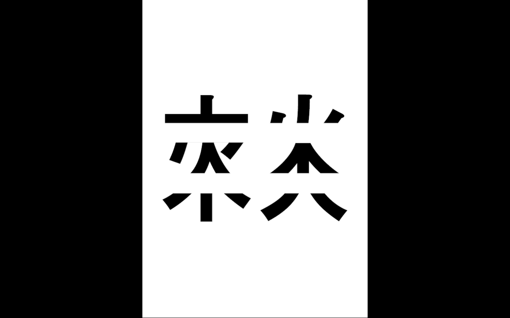

# *fire-woods* (2020)

Sound and Video (worked with Hee-yun Im)

[📼 Video and Sound 📢 *Fire-woods* (2020)](https://youtu.be/RSH8jbFOvWU)

© Hee-Ju Im, Hee-Yun Im

*Notes*

가족이란 물리/신체적으로 나와 가장 유사하게 구성되어 있는 타자이다. 우리의 어머니는 ‘임희주’,와 ‘임희윤’을 몸에서 열 달 동안 키워낸 후 밖으로 밀어냈다. 세상으로 나오게 된 우리는 가족 내의 규범, 가족 바깥의 규범안에서 타인과 행위하고 관계 맺으며 각자도생 했다.

어느 때에는 서로 가까웠고 어느 때에는 서로 멀었다. 어느 때에는 서로 증오했고 어느 때에는 서로를 매우 아꼈다. 비행기로 12시간 떨어져 있는 곳에 살기도 했고 한 침대에서 잠을 자기도 했다.
가족이라는 공동체 안에서 ‘임희주’와 ‘임희윤’은 가족 구성원으로서의 역할을 잘 수행하길 기대 받아왔다. 다른 가족 구성원도 마찬가지였다. 누군가는 그 자리에서 역할을 묵묵히 수행했고 누군가는 기대에 부응하지 못했다. 강요와 비난이 있었고 서로 상처를 냈다. 상처를 낸다는 것은 기대한다는 것이고 기대라는 것은 인정을 목표로 한다.

가족이라고 구분지어진 희윤과 희주는 가깝기도 했고 멀기도 했다. 이러한 구분짓기와 정의내리기로 인해 고유한 그들의 이름은 지워졌다 생겼다 했다.  
하지만 우리는 결코 규범과 규칙으로부터 자유로울 수 없다. 규범을 부정하기 위해서는 그 안으로 들어가야 한다. 예수가 인간의 죄를 사하기 위해서 하늘에서부터 내려온 것처럼, 차라투스트라가 하산한 것처럼. 우리는 예수도 아니고   어린아이도 아니기에 뒤돌아보고 마음 아픈 후 비아냥거리기로 했다.

 Family is the other that is most like me physically. Our mother raised "Hee-ju" and "Hee-yun" in her body for 10 months and pushed us out. When we came out into the world, we each lived by acting and having relationships with others within the norms within and outside the family. At times we were close and at times we were far. At times we hated each other and at times we cared for each other. We lived 12 hours apart by plane or slept right next to each other in the same bed. In the community of family, Im Hee-ju and Im Hee-yun have been expected to perform their roles as family members. So did other family members. Some people silently performed their roles on the spot, while others did not live up to expectations. There were coercion and criticism, and we hurt each other. To hurt is to expect, and to expect is to aim for recognition.

Hee-yun and Hee-ju, who were separated as family, were both close and distant. Due to this distinction and definition, their unique names were erased and created. But we can never be free from norms and rules. In order to deny the norm, one must enter into it. Just as Jesus came down from heaven to forgive the sins of mankind, as Zarathustra descended. We were neither Jesus nor children, so we decided to look back and to be sarcastic after we got hurt.

# *Fire-woods* (2020) 
Single Channel Video, Stereo Sounds, 9'51"

Video Screenshots

